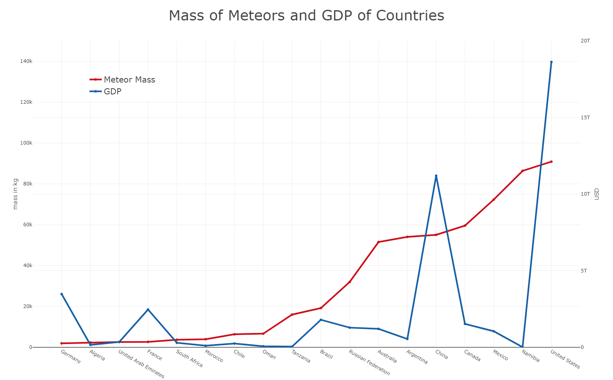

<h1 align="center">Mass of Meteors and GDP of Countries</h1>

<p align="center">
  <a href="https://creativecommons.org/publicdomain/zero/1.0/">
    
  </a>
  <a href="https://zenodo.org/badge/latestdoi/125774185">
    
  </a>
  <a href="https://orcid.org/0000-0001-5159-8864">
    
  </a>
</p>

In this project the mass of over 45,000 meteor records are compared to the GDP of the countries in which they landed.
The experiment shows a clear correlation between the two seemingly isolated datasets. The results can be inspected
either as [raw data](out/meteors_gdp.csv) or in the image below.



## Author

Alexander Schwarz | [ORCiD](https://orcid.org/0000-0001-5159-8864)

## Technologies

The sourcecode is written in python 3. It relies on following external modules:
* [plotly](https://github.com/plotly/plotly.py)
* [pycountry](https://bitbucket.org/flyingcircus/pycountry)
* [reverse-geocoder](https://github.com/thampiman/reverse-geocoder)

These modules and the dependencies including the version numbers are located in the [requiremnts.txt](requirements.txt)
file.

## Input Datasets

Two input datasets are needed for the experiment. They are already stored in the [res](res) directory and do not
have to be downloaded from external sources. However, the external repository link and a direct download link to the
datasets are provided below for verification.

#### 1. Meteorite Landings (Meteorite-Landings.csv)

This dataset contains over 45,000 meteorite landings. The high level structure of the dataset is depicted below.

| Name | Id | NameType | Classification | Mass | Fall | Year | Coordinates |
| --- | --- | -------- | -------------- | ---- | ---- | ---- | ----------- |

For the experiment only the Mass and the Coordinate fields are used. Records where one of these fields is not available
are omitted.

[repository link](https://doi.org/10.24097/wolfram.08737.data) |
[direct link](https://www.wolframcloud.com/objects/8ae6268d-3eaf-4f3a-8928-05d140a08e20)
(SHA1: 089647def41b01284ef9a51cf26998636db601b4)

#### 2. Country, Regional and World GDP (meteors_gdp.csv)

This dataset contains the country, regional and world GDP in current US Dollars over several years. The high level
structure of the dataset is depicted below.

| Country Name | Country Code | Year | Value |
| ------------ | ------------ | ---- | ----- |

For the experiment only the Country Cody, Year and Value fields are used. Furthermore, only records of the most recent
year (2016) are used. 

[repository link](https://datahub.io/core/gdp) |
[direct link](https://pkgstore.datahub.io/core/gdp/gdp_csv/data/0048bc8f6228d0393d41cac4b663b90f/gdp_csv.csv)
(SHA1: cda77de924aab382dd32bd8f88efc0ec4f8ebc74)

## Output Dataset

The resulting dataset is a .csv file which can be found [here](out/meteors_gdp.csv). The structure is as follows.

| Country | Meteor Mass | GDP |
| ------- | ----------- | --- |

The unit of the mass is kg and the currency of GDP is USD.

## Replication of the Experiment

In order to replicate the results of the experiment two methods are possible:

#### Method 1 (manually)

1. download and install python 3.6+
2. download the repository
3. install the dependencies with: ```$ pip install -r requirements.txt```
4. run the experiment with: ```$ python main.py```

Disclaimer: during step 4 a web browser with javascript capabilities has to open in order to generate the graph image.

If everything worked the graph image will be downloaded and the resulting raw data will be in generated. 
___

#### Method 2 (Dockerfile)

1. download and install Docker
2. build the docker image with: ```$ docker build -t meteorite-gdp-i .```
3. create and run the docker container with: ```$ docker run --name meteorite-gdp meteorite-gdp-i```
4. copy the raw data result to the host with: ```$ docker cp meteorite-gdp:out/meteors_gdp.csv <destination>```

In order to create the result image the temp.html file has to be copied to the host machine and opened:

5. ```$ docker cp meteorite-gdp:out/temp.html <destination>```

## Licences

Code and Data: [CC-0](https://creativecommons.org/publicdomain/zero/1.0/)
